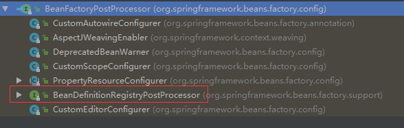
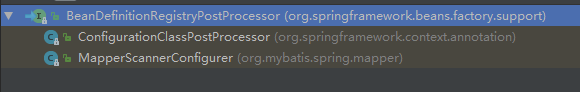
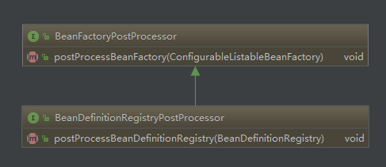
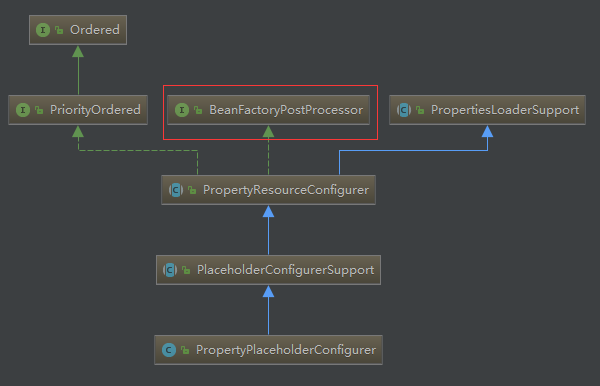
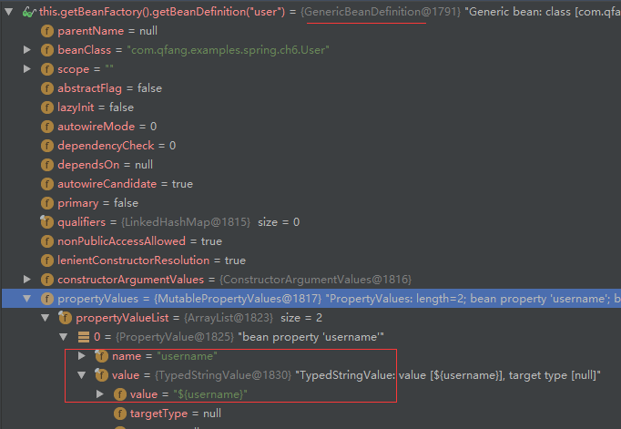

# BeanFactoryPostProcessor 介绍


### BeanFactoryPostProcessor 介绍
- 这个接口用来在容器启动过程中对 `BeanDefinition` 进行修改的一个扩展点
- 在 `BeanDefinition` 解析之后，初始之前被调用
- 参考示例： `CustomScopeConfigurer`（扩展自定义的 scope） & `PlaceholderConfigurerSupport`（对配置文件中的占位符进行解析）都是通过扩展 `BeanFactoryPostProcessor` 接口来实现




### BeanDefinitionRegistryPostProcessor 介绍
- 是 `BeanFactoryPostProcessor` 的另外一个比较重要的子类
- 从命名上也可以看出 `BeanDefinitionRegistryPostProcessor` 接口是用来对 `BeanDefinition` 注册进行修改的一个扩展点
- 会在 `BeanFactoryPostProcessor` 调用之前被调用
- 参考示例： `ConfigurationClassPostProcessor`（用来对 `@Configuration` 注解进行处理）& `MapperScannerConfigurer`（mybatis 中用来对所有的 DAO 接口接口生成实例）都是通过扩展 `BeanDefinitionRegistryPostProcessor` 接口来实现






### 入口方法
1、`AbstractApplicationContext#refresh` 方法
``` java
invokeBeanFactoryPostProcessors(beanFactory);
```
2、`AbstractApplicationContext#invokeBeanFactoryPostProcessors` 方法
``` java
protected void invokeBeanFactoryPostProcessors(ConfigurableListableBeanFactory beanFactory) {
  PostProcessorRegistrationDelegate.invokeBeanFactoryPostProcessors(beanFactory, getBeanFactoryPostProcessors());
}
```
3、`PostProcessorRegistrationDelegate#invokeBeanFactoryPostProcessors` 方法
``` java
public static void invokeBeanFactoryPostProcessors(
			ConfigurableListableBeanFactory beanFactory, List<BeanFactoryPostProcessor> beanFactoryPostProcessors) {

  // 1）实例化并且初始化所有 BeanDefinitionRegistryPostProcessor 接口的实现类 （按照 PriorityOrdered, Ordered, and the rest 顺序调用）
  // 2）实例化并且初始化所有 BeanFactoryPostProcessor 接口的实现类（按照 PriorityOrdered, Ordered, and the rest 顺序调用）
  // 注：所有的 BeanDefinitionRegistryPostProcessor & BeanFactoryPostProcessor 都会在这里被提前实例化（beanFactory.getBean）
}

```

### 示例：分析 `PropertyPlaceholderConfigurer` 如何对配置文件中的占位符属性进行替换

1、`PropertyPlaceholderConfigurer` 是继承自 `BeanFactoryPostProcessor` 接口，那其对应的接口实现方法会在容器启动（`#refresh` 方法）的 `invokeBeanFactoryPostProcessors(beanFactory);` 被调用



2、接下来我们看下 `PropertyPlaceholderConfigurer` 中 `BeanFactoryPostProcessor` 接口实现方法

``` java
// PropertyResourceConfigurer#postProcessBeanFactory
@Override
public void postProcessBeanFactory(ConfigurableListableBeanFactory beanFactory) throws BeansException {
  try {
    // 检查否允许（localOverride 属性）本地应用的一些配置来替换 jar 包里面配置等，如果允许则会将本地配置值替换默认的配置值
    Properties mergedProps = mergeProperties();

    // 用来将配置文件中配置的值做一些转换
    // 例如：一些秘密在配置文件中配置的是密文，那么可以在这里将密文转换成对应的明文
    convertProperties(mergedProps);

    // 对配置文件中的占位符属性进行替换的关键代码
    // 真正意义上就是将 BeanDefinition 中对应的 PropertyValue 里的 value 属性值进行替换
    processProperties(beanFactory, mergedProps);
  }
  catch (IOException ex) {
    throw new BeanInitializationException("Could not load properties", ex);
  }
}
```

PS: BeanDefinition 中 PropertyValue 替换之前的值



2.1、通过覆盖 `#convertProperties` 方法来实现属性值的加密解密功能

system.properties 配置文件
```
username=test
password=123456
```

自定义 PropertyPlaceholder 来实现对属性文件中的 password 属性加密功能
``` java
public class MyExtPropertyPlaceholderConfigurer extends PropertyPlaceholderConfigurer {

    private static final String PASSWORD = "password";

    @Override
    protected String convertProperty(String propertyName, String propertyValue) {
        if(PASSWORD.equals(propertyName)) {
            // 对配置文件中的明文进行加密的功能
            // 配置文件中配置的是明文，但是真正替换的 bean 属性中时是密文
            return MD5Utils.encrypted(propertyValue);
        }
        return super.convertProperty(propertyName, propertyValue);
    }

}
```

2.2、`#processProperties` 方法

org.springframework.beans.factory.config.PropertyPlaceholderConfigurer#processProperties

``` java
protected void processProperties(ConfigurableListableBeanFactory beanFactoryToProcess, Properties props)
    throws BeansException {

  StringValueResolver valueResolver = new PlaceholderResolvingStringValueResolver(props);
  doProcessProperties(beanFactoryToProcess, valueResolver);
}
```

org.springframework.beans.factory.config.PlaceholderConfigurerSupport#doProcessProperties

``` java
protected void doProcessProperties(ConfigurableListableBeanFactory beanFactoryToProcess,
    StringValueResolver valueResolver) {

  BeanDefinitionVisitor visitor = new BeanDefinitionVisitor(valueResolver);

  String[] beanNames = beanFactoryToProcess.getBeanDefinitionNames();
  for (String curName : beanNames) {
    if (!(curName.equals(this.beanName) && beanFactoryToProcess.equals(this.beanFactory))) {
      // 对所有的 BeanDefinition 进行属性替换
      BeanDefinition bd = beanFactoryToProcess.getBeanDefinition(curName);
      visitor.visitBeanDefinition(bd);
    }
  }
}
```

org.springframework.beans.factory.config.BeanDefinitionVisitor#visitBeanDefinition
``` java
// 这个方法的实现就决定了 BeanDefinition 中那些对方可以使用占位符属性
public void visitBeanDefinition(BeanDefinition beanDefinition) {
  visitParentName(beanDefinition);
  visitBeanClassName(beanDefinition);
  visitFactoryBeanName(beanDefinition);
  visitFactoryMethodName(beanDefinition);
  visitScope(beanDefinition);
  // 对属性占位符值进行替换的地方
  visitPropertyValues(beanDefinition.getPropertyValues());
  ConstructorArgumentValues cas = beanDefinition.getConstructorArgumentValues();
  visitIndexedArgumentValues(cas.getIndexedArgumentValues());
  visitGenericArgumentValues(cas.getGenericArgumentValues());
}
```

org.springframework.beans.factory.config.BeanDefinitionVisitor#resolveValue
``` java
protected Object resolveValue(Object value) {
		if (value instanceof BeanDefinition) {
			visitBeanDefinition((BeanDefinition) value);
		}
		else if (value instanceof BeanDefinitionHolder) {
			visitBeanDefinition(((BeanDefinitionHolder) value).getBeanDefinition());
		}
		else if (value instanceof RuntimeBeanReference) {
			RuntimeBeanReference ref = (RuntimeBeanReference) value;
			String newBeanName = resolveStringValue(ref.getBeanName());
			if (!newBeanName.equals(ref.getBeanName())) {
				return new RuntimeBeanReference(newBeanName);
			}
		}
		else if (value instanceof RuntimeBeanNameReference) {
			RuntimeBeanNameReference ref = (RuntimeBeanNameReference) value;
			String newBeanName = resolveStringValue(ref.getBeanName());
			if (!newBeanName.equals(ref.getBeanName())) {
				return new RuntimeBeanNameReference(newBeanName);
			}
		}
		else if (value instanceof Object[]) {
			visitArray((Object[]) value);
		}
		else if (value instanceof List) {
			visitList((List) value);
		}
		else if (value instanceof Set) {
			visitSet((Set) value);
		}
		else if (value instanceof Map) {
			visitMap((Map) value);
		}
		else if (value instanceof TypedStringValue)
      // 一般情况下属性占位符的值都是这种类型 {name: username, value: ${username}}，替换之后会将 ${username} 替换成真正的配置文件中的值
			TypedStringValue typedStringValue = (TypedStringValue) value;
			String stringValue = typedStringValue.getValue();
			if (stringValue != null) {
				String visitedString = resolveStringValue(stringValue);
				typedStringValue.setValue(visitedString);
			}
		}
		else if (value instanceof String) {
			return resolveStringValue((String) value);
		}
		return value;
	}
```

### 示例：MapperScannerConfigurer


org.springframework.beans.factory.config.PropertyPlaceholderConfigurer
org.springframework.beans.factory.config.CustomScopeConfigurer
