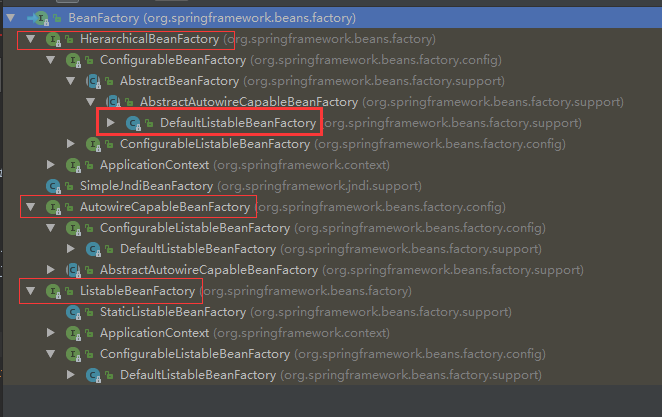
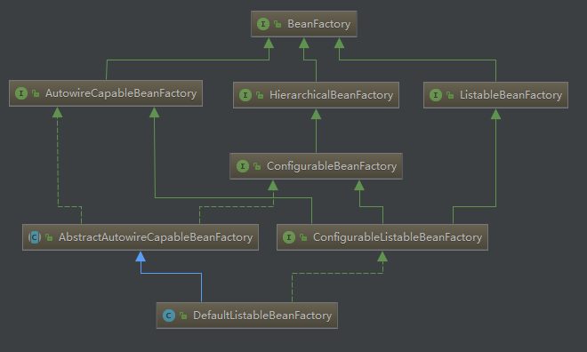
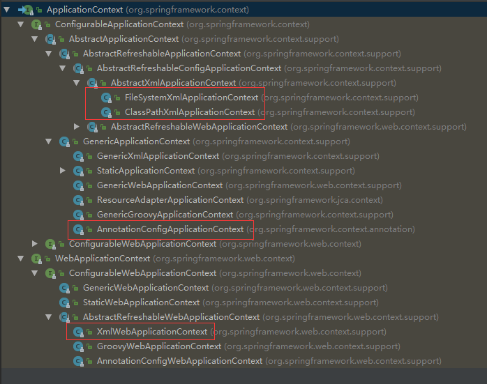

# BeanFactory & ApplicationContext 主要接口介绍

### BeanFactory 主要接口

- `BeanFactory` 作为最顶层的一个接口类，它定义了IOC容器的基本功能规范
- `HierarchicalBeanFactory` 表示 beanFactory 是有层次关系的，也就是说 beanFactory 可能存在父 beanFactory
- `ListableBeanFactory` 表示这些 Bean 是可列表的，主要定义了一些 bean 查找方法
- `AutowireCapableBeanFactory` 定义 bean 的自动装配规则
- `DefaultListableBeanFactory` 实现了上面所有的接口

### ApplicationContext 主要实现类介绍

- `ClassPathXmlApplicationContext` 最常用的，基于类路径下 xml 文件创建容器
- `FileSystemXmlApplicationContext` 基于文件系统中的 xml 文件创建容器
- `AnnotationConfigApplicationContext` 基于注解的方式配置容器
- `XmlWebApplicationContext` web 应用时默认使用的容器（web.xml 中通过 listener 配置后默认就是使用该容器类）
