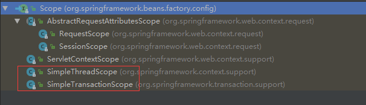

# bean scope 全解

### spring score 默认5个可选配置
- singleton
- prototype
- request
- session
- global session

### spring 内置已实现的 Scope 接口类



### 示例：自定义 Scope 的实现及相关配置
1、通过 `org.springframework.beans.factory.config.CustomScopeConfigurer` 类来配置自定义扩展的 scope，key 为 scope name，value 为实现了 `Scope` 接口的具体类
``` xml
<bean id="customScopeConfigurer" class="org.springframework.beans.factory.config.CustomScopeConfigurer">
	<property name="scopes">
		<map>
			<entry key="thread" value-ref="threadScope" />
		</map>
	</property>
</bean>

<bean id="threadScope" class="org.springframework.context.support.SimpleThreadScope" />
```
2、定义的 bean 现在可以使用自定义的 scope 了
``` xml
<bean id="demoBean" class="com.qfang.examples.spring.DemoBean" scope="thread">
	<property name="name" value="test" />
</bean>
```
3、验证自定义 scope
``` java
// t1 线程获取两次，得到的是同一个 bean 实例
// t1 和 t2 线程获取的是两个不同的 bean 实例
Thread t1 = new Thread(() -> {
		DemoBean db2 = context.getBean(DemoBean.class);
		System.out.println("thread1 : " + db2);

		DemoBean db3 = context.getBean(DemoBean.class);
		System.out.println("thread1 : " + db3);
});

Thread t2 = new Thread(() -> {
		DemoBean db3 = context.getBean(DemoBean.class);
		System.out.println("thread2 : " + db3);
});
```

4、附：`SimpleThreadScope` 部分代码  
完整代码参考 `org.springframework.context.support.SimpleThreadScope`
``` java
private final ThreadLocal<Map<String, Object>> threadScope =
    new NamedThreadLocal<Map<String, Object>>("SimpleThreadScope") {
      @Override
      protected Map<String, Object> initialValue() {
        return new HashMap<String, Object>();
      }
    };


@Override
public Object get(String name, ObjectFactory<?> objectFactory) {
  // 每个线程维护一个独立的 map，该 map 中存放的就是所有 thread scope 的 bean 实例
  Map<String, Object> scope = this.threadScope.get();
  Object object = scope.get(name);
  if (object == null) {
    object = objectFactory.getObject();
    scope.put(name, object);
  }
  return object;
}
```


### spring 自定义的 scope 是如何在 #getBean() 时起作用
从上面示例中可以看到，如果需要扩展一个自定义的 scope，我们需要将自定义的 scope 配置到 `org.springframework.beans.factory.config.CustomScopeConfigurer` 这个 bean 中，那么这个 `CustomScopeConfigurer` 又是如何将所有我们自定义的 scope 注册到 spring beanFactory 中的呢？  
答案就在于 `CustomScopeConfigurer` 是实现了 `org.springframework.beans.factory.config.BeanFactoryPostProcessor` 接口的类。  
详细的实现参考：`org.springframework.beans.factory.config.CustomScopeConfigurer#postProcessBeanFactory` 方法，在该方法里面 `CustomScopeConfigurer` 循环所有用户配置的自定义 scope key，然后将其注册到 `org.springframework.beans.factory.config.ConfigurableListableBeanFactory` beanFactory 中


bean 实例化时重要的入口方法：
`org.springframework.beans.factory.support.AbstractBeanFactory#doGetBean`  
- 在这个 #getBean 的方法中可以看到，spring 处理了 `singleton`, `prototype` 和 `custom` 三种不同的 scope 下 bean 的获取
- `singleton`： 对于所有单例的 bean spring 使用 `DefaultSingletonBeanRegistry` 这个类来管理和缓存（`DefaultSingletonBeanRegistry#singletonObjects` 这个 map 就是缓存 spring 容器中所有单例 bean 的地方）
- `prototype`： 客户端每次调用 `#getBean` 方法时都是获取新的对象
- `custom scope`： 则是有具体的 scope 实现类的 `#get` 方法来控制
- 注意：这个方法是 `#getBean` 的方法，但是真正创建 bean 的过程，对应三种 scope 来说都是交由 `#createBean()` 方法去实现（即 bean 的创建方法是统一的，只是创建之后 bean 是否需要缓存，缓存在什么范围内，事由 `Scope` 这个接口的实现类来控制的）

``` java
// AbstractBeanFactory#doGetBean 方法部分代码

if (mbd.isSingleton()) {
  // singleton
	sharedInstance = getSingleton(beanName, new ObjectFactory<Object>(//...) {}});
}

else if (mbd.isPrototype()) {
	// prototype 每次调用 getBean 方法都将获取到一个新的实例
	Object prototypeInstance = null;
	try {
		beforePrototypeCreation(beanName);
		prototypeInstance = createBean(beanName, mbd, args);
	}
	finally {
		afterPrototypeCreation(beanName);
	}
}

else {
	String scopeName = mbd.getScope();
	final Scope scope = this.scopes.get(scopeName);
	try {
		Object scopedInstance = scope.get(beanName, new ObjectFactory<Object>() {//...}
  });
}
```

参考：  
[spring bean scope 配置详解](http://blog.csdn.net/mastermind/article/details/1932787)
