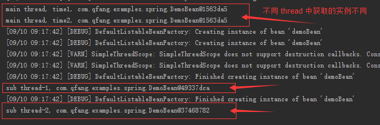

# spring 自定义标签介绍

### 什么是 spring 自定义标签
我们使用 spring xml 配置时，经常会使用到类似 `<context:component-scan base-package="" />`、`<context:property-placeholder location="" />` 这样的配置，这些就是 spring 的自定义标签，通过这些自定义标签可以大大简化 spring 的配置，本文主要剖析这些标签到底是怎样取作用的，并且通过一个示例来实际讲解下如何定制自己的 spring 的标签。


下面我们以 `<context:property-placeholder location="" />` 这个自定标签为例来剖析下 spring 中自定义标签的实现原理。正常情况下如果我们需要引入一个 properties 属性文件到 spring 配置中，如果不使用自定义标签时的配置如下：  
``` xml
<bean id="placeholderConfigurer" class="org.springframework.context.support.PropertySourcesPlaceholderConfigurer">
    <property name="location" value="classpath:ch9/homework/jdbc.properties" />
</bean>
```
可以看到此时我们配置了一个 `PropertySourcesPlaceholderConfigurer` bean 来实现将 `BeanDefinition` 中的 `${xxx}` 占位符替换成 properties 文件中真正的属性值。而如果使用自定义标签进行配置时，我们只需要如下配置：

``` xml
<context:property-placeholder location="classpath:ch9/homework/jdbc.properties" />
```
此时我们并没有指定用来解析和替换 properties 文件使用的 bean，spirng 内部到底是怎么帮我们实现的呢？

- 首先我们知道的是如果要使用自定义标签时，就必须引入对应的 xsd 文件，这通常可以在 xml 文件的最顶层看到，该 xsd 文件就是定义该自定义标签在 xml 中的配置规范  
- 其次所有 spring 的自定义标签都需要一个对应的 `NamespaceHandler` 来处理，例如 `<context:property-placeholder />` 标签对应的是 `ContextNamespaceHandler`
- 打开该 `ContextNamespaceHandler` 就可以看到里面为每一个标签都注册了一个 `BeanDefinitionParser` 来解析 xml 中标签的配置成一个 `BeanDefinition` 实例，并且注册到 spring 容器中，例如 `<context:property-placeholder />` 标签对应的是 `PropertyPlaceholderBeanDefinitionParser` 的 #parse 方法

- 最后需要解决的问题就是 spring 如何知道每个自定义标签该使用哪个 `NamespaceHandler` 来进行处理的问题，该配置可以在 spring jar 包的 `META-INF/spring.handlers` 文件中查看到，例如 context 对应的 handler 的配置项 `http\://www.springframework.org/schema/context=org.springframework.context.config.ContextNamespaceHandler`

> 注：整个过程的重点就在 `BeanDefinitionParser` 解析和注册 `BeanDefinition` 的地方，而如果我们需要扩展我们自定义的标签，这个步骤也是我们的关键逻辑所在


### BeanDefinitionParser#parse 方法剖析
我们重点来剖析下 `PropertyPlaceholderBeanDefinitionParser#parse` 方法，部分关键代码如下：

``` java
@Override
public final BeanDefinition parse(Element element, ParserContext parserContext) {
	// 解析 BeanDefinition
	AbstractBeanDefinition definition = parseInternal(element, parserContext);
	if (definition != null && !parserContext.isNested()) {
		String id = resolveId(element, definition, parserContext);
		// ...
		BeanDefinitionHolder holder = new BeanDefinitionHolder(definition, id, aliases);
		// 注册 BeanDefinition
		registerBeanDefinition(holder, parserContext.getRegistry());

	}
	return definition;
}
```

`#parseInternal` 方法关键代码
``` java
@Override
protected final AbstractBeanDefinition parseInternal(Element element, ParserContext parserContext) {
	BeanDefinitionBuilder builder = BeanDefinitionBuilder.genericBeanDefinition();

	// 获取 BeanDefinition 对应的 class
	Class<?> beanClass = getBeanClass(element);
	if (beanClass != null) {
		builder.getRawBeanDefinition().setBeanClass(beanClass);
	}

	// 解析具体的配置文件属性值
	doParse(element, parserContext, builder);
	return builder.getBeanDefinition();
}
```

`#getBeanClass` 方法
``` java
@Override
protected Class<?> getBeanClass(Element element) {
	if (SYSTEM_PROPERTIES_MODE_DEFAULT.equals(element.getAttribute(SYSTEM_PROPERTIES_MODE_ATTRIBUTE))) {
		// BeanDefinition 对应的 beanClass
		return PropertySourcesPlaceholderConfigurer.class;
	}

	return PropertyPlaceholderConfigurer.class;
}
```

`#doParse` 方法关键代码
``` java
@Override
protected void doParse(Element element, BeanDefinitionBuilder builder) {
	// 这里就是解析自定义标签中属性值的地方
	String location = element.getAttribute("location");
	if (StringUtils.hasLength(location)) {
		String[] locations = StringUtils.commaDelimitedListToStringArray(location);
		builder.addPropertyValue("locations", locations);
	}
	// ...
	builder.setRole(BeanDefinition.ROLE_INFRASTRUCTURE);
}
```

以上所有的代码从 `#parse` -> `#parseInternal` -> `#doParse` 方法的逻辑就是解析配置文件中的自定义标签，并且生成一个 `BeanDefinition` 实例，该 `BeanDefinition` 的 beanClass 为 `PropertySourcesPlaceholderConfigurer`，而这些逻辑就相当于之前 xml 方式的配置   


### 示例：自定扩展 spring 标签
通过上面示例的分析，我们应该大致知道了要扩展一个 spring 自定义的标签需要以下几个步骤
- 创建一个 xsd 文件，定义自定义标签在 xml 文件中的配置规范
- 创建一个类实现 `BeanDefinitionParser` 接口，用来解析 xml 中自定义标签的配置
- 创建一个 Handler 类，扩展 `NamespaceHandlerSupport` 目的是为每个标签属性注册一个具体的 `BeanDefinitionParser`
- 在 META-INF 下面创建 spring.handlers 和 spring.schemas 文件来配置该自定义标签使用哪个 `NamespaceHandler` 进行处理

下面我们通过一个示例来展示通过自定义标签的步骤
spring 允许用户自定义 scope 级别，只需要自行实现 `Scope` 接口即可，如果我们希望 spring bean 的 scope 级别为 thread 级别（即每个线程获取的 bean 的实例是不同的），我们需要进行如下配置：

``` xml
<bean id="customScopeConfigurer" class="org.springframework.beans.factory.config.CustomScopeConfigurer">
	<property name="scopes">
		<map>
			<entry key="thread" value-ref="simpleThreadScope"></entry>
		</map>
	</property>
</bean>
<bean id="simpleThreadScope" class="org.springframework.context.support.SimpleThreadScope" />

<!-- 这个 bean 的 scope 就为 thread 级别，每个线程获取的 bean 都是不同的实例 -->
<bean id="demoBean" class="com.qfang.examples.spring.DemoBean" scope="thread" />
```
但是我们希望通过简化的标签 `<scope:thread />` 来替代上面复杂的配置，具体的实现如下：

**1、配置 spring.handlers**  
在 src/main/resources 目录下新建 META-INF 文件夹，新建两个配置文件 spring.schemas & spring.handlers  
spring.handlers 内容如下：  
http\://www.qfang-examples.com/schema/scope=com.qfang.examples.spring.ch5.ScopeNamespaceHandler
spring.schemas 内容如下（该配置文件指定 xsd 文件在对应的 jar 包下加载，不需要在网络中加载）：  
http\://www.qfang-examples.com/schema/scope/spring-scope-4.3.xsd=ch5/spring-scope-4.3.xsd

**2、编写 xsd 文件**  
spring-scope-4.3.xsd 文件如下：
``` xml
<?xml version="1.0" encoding="UTF-8" standalone="no"?>
<xsd:schema xmlns="http://www.qfang-examples.com/schema/scope"
            xmlns:xsd="http://www.w3.org/2001/XMLSchema"
            targetNamespace="http://www.qfang-examples.com/schema/scope">

    <xsd:element name="thread" type="threadType">
    </xsd:element>

    <xsd:complexType name="threadType">
    </xsd:complexType>

</xsd:schema>
```

**3、实现 NamespaceHandler 接口**  
``` java
public class ScopeNamespaceHandler extends NamespaceHandlerSupport {

    @Override
    public void init() {
        registerBeanDefinitionParser("thread", new ScopeThreadBeanDefinitionParser());
    }

}
```

**4、实现 BeanDefinitionParser 接口**  
``` java
class ScopeThreadBeanDefinitionParser implements BeanDefinitionParser {

	@Override
	public BeanDefinition parse(Element element, ParserContext parserContext) {
		RootBeanDefinition beanDefinition = new RootBeanDefinition();
		beanDefinition.setBeanClass(CustomScopeConfigurer.class);
		beanDefinition.setScope("singleton");

		Map<String, Object> scopes = new HashMap<>();
		scopes.put("thread", new SimpleThreadScope());
		beanDefinition.getPropertyValues().add("scopes", scopes);

		parserContext.getRegistry().registerBeanDefinition("customScopeConfigurer", beanDefinition);
		return beanDefinition;
	}
}
```

**5、applicationContext.xml 文件**  
``` xml
<?xml version="1.0" encoding="UTF-8"?>
<beans xmlns="http://www.springframework.org/schema/beans"
	xmlns:xsi="http://www.w3.org/2001/XMLSchema-instance" xmlns:scope="http://www.qfang-examples.com/schema/scope"
	xsi:schemaLocation="
     http://www.springframework.org/schema/beans http://www.springframework.org/schema/beans/spring-beans-4.3.xsd
	http://www.qfang-examples.com/schema/scope http://www.qfang-examples.com/schema/scope/spring-scope-4.3.xsd">

	<scope:thread />

	<bean id="demoBean" class="com.qfang.examples.spring.DemoBean" scope="thread" />

</beans>
```

**6、Main.java 测试**  
``` java
public static void main(String[] args) {
	ClassPathXmlApplicationContext context = new ClassPathXmlApplicationContext("ch5/applicationContext.xml");
	DemoBean db = context.getBean(DemoBean.class);
	System.out.printf("main thread, time1, %s \r\n", db);

	new Thread(() -> {
		DemoBean db1 = context.getBean(DemoBean.class);
		System.out.printf("sub thread-1, %s \r\n" ,db1);
	}).start();

	new Thread(() -> {
		DemoBean db1 = context.getBean(DemoBean.class);
		System.out.printf("sub thread-2, %s \r\n" ,db1);
	}).start();

	System.out.printf("main thread, time2, %s \r\n", context.getBean(DemoBean.class));
}
```

运行结果：  

