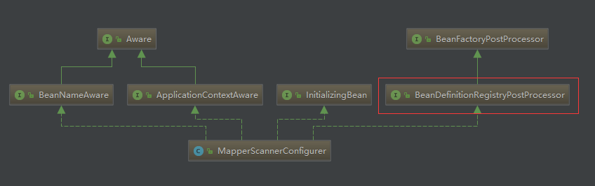

# mybatis MapperScannerConfigurer 示例

使用过 mybatis 的人应该都知道，mybatis 有个特性就是对于 Mapper 类，只需要声明接口就可以了，而不需要写具体的实现类，上层在使用 Mapper 接口时只需要直接注入 Mapper 接口就可以正常工作，下面我们就来具体剖析下 mybatis 是怎样通过这个 Mapper 接口来自动生成 Mapper 实现类，并且注册到 spring 容器中。

### 先来看一个 mybatis 的使用示例
applicationContext.xml
``` xml
<bean id="sqlSessionFactory" class="org.mybatis.spring.SqlSessionFactoryBean">
  <property name="configLocation" value="classpath:config/mybatis-config.xml" />
  <property name="dataSource" ref="dataSource" />
  <property name="mapperLocations" value="classpath:mapping/*Mapper.xml" />
</bean>

<bean class="org.mybatis.spring.mapper.MapperScannerConfigurer">
  <!-- 扫描所有 RepositoryMapper 注解的类 -->
  <property name="annotationClass" value="com.jaf.framework.core.mapper.RepositoryMapper" />
  <!-- 扫描所有 BaseMapper 接口实现类 -->
  <property name="markerInterface" value="com.jaf.framework.core.mapper.BaseMapper" />
  <property name="basePackage" value="com.hbvtc.exam.mapper.*" />
  <property name="sqlSessionFactoryBeanName" value="sqlSessionFactory" />
</bean>
```

TeacherMapper.java & BaseMapper.java
``` java
@RepositoryMapper
public interface TeacherMapper extends BaseMapper<Teacher> {

}

public interface BaseMapper<E extends BaseEntity<?>> {
    void insertEntity(E var1);

    void updateById(E var1);

    <T> void deleteById(T var1);

    <T> void deleteByIds(T[] var1);

    Page<E> pageQuery(Map<String, Object> var1);
}

@Target({ElementType.TYPE})
@Retention(RetentionPolicy.RUNTIME)
@Documented
public @interface RepositoryMapper {
}
```
这个 mapper 只有接口，没有具体的实现类，并且这个 Mapper 接口是被 `@RepositoryMapper` 注解标识的，所以可以被 mybatis 扫描到。

注意，这里的 `@RepositoryMapper` 注解只是个普通的注解，并没有被 spring `@Component` 注解标识，那么 mybatis 是怎样扫描到这些 mapper 接口，并且生成对应的实现类对象，然后注册到 spring 容器中的呢？

TeacherDaoImpl.java
```
@Repository("teacherDao")
public class TeacherDaoImpl extends BaseDaoImpl<Teacher> implements TeacherDao {

  // 像使用普通的 spring bean 一样注入 mapper 类
	@Autowired
	private TeacherMapper teacherMapper;

	@Override
	protected BaseMapper<Teacher> getMapper() {
		return teacherMapper;
	}

}
```
上层 dao 实现类中，对 mapper 的注入像普通的 bean 一样。

### 详细分析 mybatis 的 `MapperScannerConfigurer`

从上面的配置文件中可以看到，mybatis 配置的类为 `org.mybatis.spring.mapper.MapperScannerConfigurer`，也正是这个类实现了 mybatis mapper 接口的扫描，并且注册具体的实例到 spring 容器中。

先看下这个类的类继承关系图



可以看到这个类是实现了 `BeanDefinitionRegistryPostProcessor` 接口的，之前已经介绍过 `BeanDefinitionRegistryPostProcessor` 这个接口可以在 spring 容器启动过程中对 Beandefinition 注册做一些扩展。

下面我们直接来看 `BeanDefinitionRegistryPostProcessor#postProcessBeanDefinitionRegistry` 方法

``` java
public void postProcessBeanDefinitionRegistry(BeanDefinitionRegistry registry) {
  if (this.processPropertyPlaceHolders) {
    processPropertyPlaceHolders();
  }

  // ClassPathBeanDefinitionScanner 从 ClassPathBeanDefinitionScanner 继承，这个类主要负责 mybatis mapper 文件的扫描
  // 扫描的基本规则就是根据之前配置文件中配置的
  // basePackage: 在哪个包下扫描
  // markerInterface: 扫描哪个接口，markerInterface 接口的所有实现类会被扫描到
  // annotationClass: 或者是扫描被 annotationClass 注解的所有类
  ClassPathMapperScanner scanner = new ClassPathMapperScanner(registry);
  scanner.setAddToConfig(this.addToConfig);
  scanner.setAnnotationClass(this.annotationClass);
  scanner.setMarkerInterface(this.markerInterface);
  scanner.setSqlSessionFactory(this.sqlSessionFactory);
  scanner.setSqlSessionTemplate(this.sqlSessionTemplate);
  scanner.setSqlSessionFactoryBeanName(this.sqlSessionFactoryBeanName);
  scanner.setSqlSessionTemplateBeanName(this.sqlSessionTemplateBeanName);
  scanner.setResourceLoader(this.applicationContext);
  scanner.setBeanNameGenerator(this.nameGenerator);
  scanner.registerFilters();
  scanner.scan(StringUtils.tokenizeToStringArray(this.basePackage, ConfigurableApplicationContext.CONFIG_LOCATION_DELIMITERS));
}
```

`org.springframework.context.annotation.ClassPathBeanDefinitionScanner#scan`

``` java
public int scan(String... basePackages) {
  int beanCountAtScanStart = this.registry.getBeanDefinitionCount();

  doScan(basePackages);

  // Register annotation config processors, if necessary.
  if (this.includeAnnotationConfig) {
    AnnotationConfigUtils.registerAnnotationConfigProcessors(this.registry);
  }

  return (this.registry.getBeanDefinitionCount() - beanCountAtScanStart);
}
```
`#scan` 方法是在父类（`ClassPathBeanDefinitionScanner`）中定义的，其中最主要的是 `#doScan` 方法。


`org.mybatis.spring.mapper.ClassPathMapperScanner#doScan`

``` java
public Set<BeanDefinitionHolder> doScan(String... basePackages) {
  // 主要还是通过 super.doScan 方法来扫描，返回所有符合条件的 BeanDefinitionHolder
  Set<BeanDefinitionHolder> beanDefinitions = super.doScan(basePackages);

  if (beanDefinitions.isEmpty()) {
    logger.warn("No MyBatis mapper was found in '" + Arrays.toString(basePackages) + "' package. Please check your configuration.");
  } else {
    // mybatis 对返回的 Beandefinition 进行了进一步的处理
    processBeanDefinitions(beanDefinitions);
  }

  return beanDefinitions;
}
```
mybatis 的 `ClassPathMapperScanner` 类对父类中的 `#doScan` 方法做了重写，但对于 Beandefinition 的扫描和注册到 spring 容器中，主要还是通过 `super.doScan` 方法来实现。


`org.springframework.context.annotation.ClassPathBeanDefinitionScanner#doScan` 方法
``` java
protected Set<BeanDefinitionHolder> doScan(String... basePackages) {
  Assert.notEmpty(basePackages, "At least one base package must be specified");
  Set<BeanDefinitionHolder> beanDefinitions = new LinkedHashSet<BeanDefinitionHolder>();
  for (String basePackage : basePackages) {
    // 这个方法的具体逻辑就不展开了，感兴趣的可以自己跟进下源码
    // 主要过滤条件是通过 org.mybatis.spring.mapper.ClassPathMapperScanner#registerFilters 方法来完成注册的
    // 过滤条件包含配置文件中配置的 annotationClass 和 markerInterface

    // 另外这里需要注意的一点是，这里返回的 BeanDefinition 具体的实现类是 ScannedGenericBeanDefinition，并且 BeanDefinition 属性 beanClass 对应的是接口类（正常情况下应该是一个具体的实现类，因为接口是无法实例化的）
    Set<BeanDefinition> candidates = findCandidateComponents(basePackage);
    for (BeanDefinition candidate : candidates) {
      ScopeMetadata scopeMetadata = this.scopeMetadataResolver.resolveScopeMetadata(candidate);
      candidate.setScope(scopeMetadata.getScopeName());
      String beanName = this.beanNameGenerator.generateBeanName(candidate, this.registry);
      if (candidate instanceof AbstractBeanDefinition) {
        postProcessBeanDefinition((AbstractBeanDefinition) candidate, beanName);
      }
      if (candidate instanceof AnnotatedBeanDefinition) {
        // 处理其他的一些注解(@Lazy, @Primary, @DependsOn...)
        AnnotationConfigUtils.processCommonDefinitionAnnotations((AnnotatedBeanDefinition) candidate);
      }
      if (checkCandidate(beanName, candidate)) {
        BeanDefinitionHolder definitionHolder = new BeanDefinitionHolder(candidate, beanName);
        definitionHolder =
            AnnotationConfigUtils.applyScopedProxyMode(scopeMetadata, definitionHolder, this.registry);
        beanDefinitions.add(definitionHolder);

        // 向 spring 容器注册 BeanDefinition
        registerBeanDefinition(definitionHolder, this.registry);
      }
    }
  }
  return beanDefinitions;
}
```
这个方法负责扫描 `MapperScannerConfigurer` 配置的 basePackage 下的所有符合 annotationClass 注解的接口/类，或者实现了 markerInterface 接口的接口/类，并且生成对应的 BeanDefinition，然后注册到 spring 容器中。  
到目前为止我们应该解决了 mybatis 是如何扫描到所有的 mapper 接口，并且注册到 spring 容器中的问题，但是需要注意的是这里返回的 BeanDefinition 里面的 beanClass 属性对应的可能接口类，一个接口是没办法被实例化的，也就是目前为止扫描到的这些 BeanDefinition 在后续 spring 容器启动过程中没办法生成对应的 bean 实例。  
我们继续回到上面的 `org.mybatis.spring.mapper.ClassPathMapperScanner#doScan` 这个方法，这个方法里面还有调用了一个很重要的方法就是 `org.mybatis.spring.mapper.ClassPathMapperScanner#processBeanDefinitions`，具体源代码如下（删除了部分日志打印相关代码）：

``` java
private void processBeanDefinitions(Set<BeanDefinitionHolder> beanDefinitions) {
  GenericBeanDefinition definition;
  for (BeanDefinitionHolder holder : beanDefinitions) {
    definition = (GenericBeanDefinition) holder.getBeanDefinition();

    // 这两句代码时关键，这里将 beanClass 进行了重新设置，设置为了 MapperFactoryBean，并且将原来接口 class 设置为构造方法参数
    definition.getConstructorArgumentValues().addGenericArgumentValue(definition.getBeanClassName()); // issue #59
    definition.setBeanClass(this.mapperFactoryBean.getClass());

    definition.getPropertyValues().add("addToConfig", this.addToConfig);

    // 设置 sqlSessionFactory，如果有配置
    boolean explicitFactoryUsed = false;
    if (StringUtils.hasText(this.sqlSessionFactoryBeanName)) {
      definition.getPropertyValues().add("sqlSessionFactory", new RuntimeBeanReference(this.sqlSessionFactoryBeanName));
      explicitFactoryUsed = true;
    } else if (this.sqlSessionFactory != null) {
      definition.getPropertyValues().add("sqlSessionFactory", this.sqlSessionFactory);
      explicitFactoryUsed = true;
    }

    // 设置 sqlSessionTemplate，如果有配置
    if (StringUtils.hasText(this.sqlSessionTemplateBeanName)) {
      definition.getPropertyValues().add("sqlSessionTemplate", new RuntimeBeanReference(this.sqlSessionTemplateBeanName));
      explicitFactoryUsed = true;
    } else if (this.sqlSessionTemplate != null) {
      definition.getPropertyValues().add("sqlSessionTemplate", this.sqlSessionTemplate);
      explicitFactoryUsed = true;
    }

    // 如果 sqlSessionFactory & sqlSessionTemplate 都没有指定，那么启用类型自动注入
    if (!explicitFactoryUsed) {
      definition.setAutowireMode(AbstractBeanDefinition.AUTOWIRE_BY_TYPE);
    }
  }
}
```
经过这一步的处理，现在 mybatis 扫描到的所有符合条件的 BeanDefinition 都是可以在后续 spring 容器启动过程中，转换成具体 bean 的了，也就是现在的 BeanDefinition 已经是可以正常使用的了。
下面我们再深入一步地看下这个 `MapperFactoryBean` 是如何生成具体的实现类的，因为我们的代码中并没有对 Mapper 接口生成具体的实现类，查看 `org.apache.ibatis.binding.MapperProxyFactory#newInstance` 源码如下：

``` java
public T getObject() throws Exception {
  return getSqlSession().getMapper(this.mapperInterface);
}
```

跟着调用链一直追踪，最后会调用到 `org.apache.ibatis.binding.MapperRegistry#getMapper`

``` java
public T newInstance(SqlSession sqlSession) {
  final MapperProxy<T> mapperProxy = new MapperProxy<T>(sqlSession, mapperInterface, methodCache);
  return newInstance(mapperProxy);
}

protected T newInstance(MapperProxy<T> mapperProxy) {
  // mybatis 通过 jdk 的动态代理方式来为所有的 mapper 接口生成一个代理实现类
  // 使用 MapperProxy 作为动态代理的 InvocationHandler
  return (T) Proxy.newProxyInstance(mapperInterface.getClassLoader(), new Class[] { mapperInterface }, mapperProxy);
}
```
到这里就已经非常明确了，mybatis 通过 jdk 的动态代理方式来为所有的 mapper 接口生成一个代理实现类。

顺便我们来看下 `org.apache.ibatis.binding.MapperProxy#invoke` 方法
``` java
public Object invoke(Object proxy, Method method, Object[] args) throws Throwable {
  try {
    if (Object.class.equals(method.getDeclaringClass())) {
      return method.invoke(this, args);
    } else if (isDefaultMethod(method)) {
      return invokeDefaultMethod(proxy, method, args);
    }
  } catch (Throwable t) {
    throw ExceptionUtil.unwrapThrowable(t);
  }
  // 当 mapper 接口中的一个方法被调用的时候，会进入到这里，mybatis 会对这个方法生成一个 MapperMethod 对象，并且缓存这个对象
  final MapperMethod mapperMethod = cachedMapperMethod(method);
  return mapperMethod.execute(sqlSession, args);
}
```

`org.apache.ibatis.binding.MapperMethod#execute`
``` java
// mapper 接口中的 select / update 等方法最终被执行的地方
public Object execute(SqlSession sqlSession, Object[] args) {
  Object result;
  switch (command.getType()) {
    case INSERT: {
      // 调用了 sqlSession 的 insert / update / delete ...
    Object param = method.convertArgsToSqlCommandParam(args);
      result = rowCountResult(sqlSession.insert(command.getName(), param));
      break;
    }
    case UPDATE: {
      Object param = method.convertArgsToSqlCommandParam(args);
      result = rowCountResult(sqlSession.update(command.getName(), param));
      break;
    }
    case DELETE: {
      Object param = method.convertArgsToSqlCommandParam(args);
      result = rowCountResult(sqlSession.delete(command.getName(), param));
      break;
    }
    case SELECT:
      if (method.returnsVoid() && method.hasResultHandler()) {
        executeWithResultHandler(sqlSession, args);
        result = null;
      } else if (method.returnsMany()) {
        result = executeForMany(sqlSession, args);
      } else if (method.returnsMap()) {
        result = executeForMap(sqlSession, args);
      } else if (method.returnsCursor()) {
        result = executeForCursor(sqlSession, args);
      } else {
        Object param = method.convertArgsToSqlCommandParam(args);
        result = sqlSession.selectOne(command.getName(), param);
      }
      break;
    case FLUSH:
      result = sqlSession.flushStatements();
      break;
    default:
      throw new BindingException("Unknown execution method for: " + command.getName());
  }
  if (result == null && method.getReturnType().isPrimitive() && !method.returnsVoid()) {
    throw new BindingException("Mapper method '" + command.getName()
        + " attempted to return null from a method with a primitive return type (" + method.getReturnType() + ").");
  }
  return result;
}
```

至此 mybatis 对于 mapper 接口的扫描、如何注册到 spring 容器中、如何对 mapper 接口生成动态代理实现类，以及动态代理类方法执行已经全部解析完了。

*本文所有源代码基于 mybatis:3.4.5 & mybatis-spring:1.3.1*
