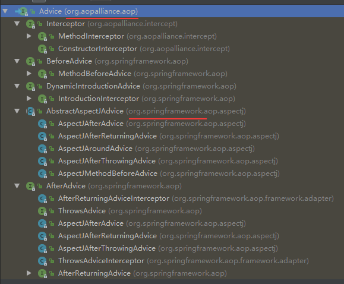
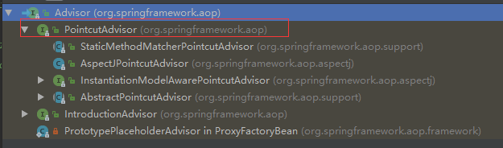
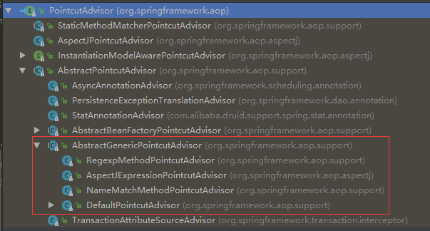
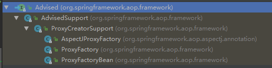

# Aop 基础知识

### AOP 的概念
**通知（Advice）：** 在AOP中，切面的工作被称为通知。通知定义了切面“是什么”以及“何时”使用。除了描述切面要完成的工作，通知还解决了何时执行这个工作的问题。Spring切面可以应用5种类型的通知：
- 前置通知（Before）：在目标方法被调用之前调用通知功能
- 后置通知（After）：在目标方法完成之后调用通知，此时不会关心方法的输出是什么
- 返回通知（After-returning）：在目标方法成功执行之后调用通知
- 异常通知（After-throwing）：在目标方法抛出异常后调用通知
- 环绕通知（Around）：通知包裹了被通知的方法，在被通知的方法调用之前和调用之后执行自定义的行为

**连接点（Join Point）：** 程序执行过程中明确的点，如方法的调用或特定的异常被抛出。在Spring AOP中，一个连接点总是表示一个方法的执行。

**切点（Pointcut）：** 如果说通知定义了切面“是什么”和“何时”的话，那么切点就定义了“何处”。比如我想把日志引入到某个具体的方法中，这个方法就是所谓的切点。Pointcut用来描述和过滤Join Point。

**引入（Introduction）：** 添加方法或字段到被通知的类。 Spring允许引入新的接口到任何被通知的对象。例如，你可以使用一个引入使任何对象实现 IsModified接口，来简化缓存。Spring中要使用Introduction, 可有通过DelegatingIntroductionInterceptor来实现通知，通过DefaultIntroductionAdvisor来配置Advice和代理类要实现的接口。

**切面（Aspect）：** 切面是通知和切点的结合。通知和切点共同定义了切面的全部内容———他是什么，在何时和何处完成其功能。

**织入（Weaving）：** 把切面应用到目标对象来创建新的代理对象的过程添加方法或字段到被通知的类。这可以在编译时完成（例如使用AspectJ编译器），也可以在运行时完成。Spring AOP，在运行时完成织入。

**目标对象（Target Object）:** 包含连接点的对象。也被称作被通知或被代理对象。

**AOP代理（AOP Proxy）:** AOP框架创建的对象。

### spring aop 中涉及的主要接口

- Advice 通知 （Interceptor 子接口，用的比较多）
- Advisor `PointcutAdvisor` 重要的实现类，包含 `Pointcut` & `Pointcut`
- Pointcut
- Advised 被代理后的 `Proxy` 对象

