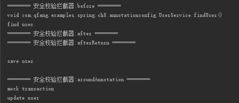

# spring 创建代理的几种方式


IUserService.java 服务接口类

``` java
public interface IUserService {
    void findUser();
}
```

服务接口的实现类
``` java
public class UserServiceImpl implements IUserService {
    @Override
    public void findUser() {
        System.out.println("find user");
    }
}
```

没有实现接口的普通服务类
``` java
public class UserService {

    public void findUser() {
        System.out.println("find user");
    }

}
```

Log Advice 实现
``` java
public class LogBeforeAdvice implements MethodBeforeAdvice {

    @Override
    public void before(Method method, Object[] args, Object target) throws Throwable {
        System.out.println("--------- 日志记录 advice -----------");
    }

}
```

另外一个 Advice
``` java
public class SecurityInterceptor implements MethodInterceptor {

    @Override
    public Object invoke(MethodInvocation invocation) throws Throwable {
        System.out.println("======== 安全校验拦截器 ========");
        return invocation.proceed();
    }
}
```

### ProxyFactory 方式
``` java
private static void addAdvice() {
    IUserService userService = new UserServiceImpl();

    // addAdvice & addAdvisor
    // addAdvice 方法接收一个 Advice 对象，但内部实现还是封装成 Advisor
    ProxyFactory proxyFactory = new ProxyFactory(userService);
    proxyFactory.addAdvice(new SecurityInterceptor());
    proxyFactory.addAdvisor(new DefaultPointcutAdvisor(new LogBeforeAdvice()));

    IUserService proxyUserService = (IUserService) proxyFactory.getProxy();
    proxyUserService.findUser();
}
```
- ProxyFactory#addAdvice 方法内部会将 `Advice` 包装成 `DefaultPointcutAdvisor`
- ProxyFactory#addAdvisor `DefaultPointcutAdvisor` 内部默认的 `Pointcut` 实现为 `TruePointcut`，该 `Pointcut` 会对任何方法的调用进行切入
- #getProxy 方法，主要的实现代码参考 `DefaultAopProxyFactory#createAopProxy`
  - 如果被代理的类有实现接口（非`SpringProxy`）那么 spring 默认采用 jdk 的动态代理实现
  - 如果被代理类没有实现任何接口，那么 spring 采用 CGLIB 方式生成动态代理类（可用通过打印返回的 proxy 的 class 类型来确定 spring 采用哪种方式生成动态代理实例）

### ProxyFactoryBean 方式

applicationContext.xml 配置
``` xml
<bean id="proxyFactoryBean" class="org.springframework.aop.framework.ProxyFactoryBean">
  <property name="target" ref="userService" /> <!-- 被代理对象 -->
  <property name="interceptorNames"> <!-- Advice / Advisor 列表 -->
    <list>
      <value>securityInterceptor</value>
      <value>logBeforeAdvice</value>
    </list>
  </property>
</bean>

<bean id="userService" class="com.qfang.examples.spring.ch8.UserService" />

<bean id="securityInterceptor" class="com.qfang.examples.spring.ch8.SecurityInterceptor" />
<bean id="logBeforeAdvice" class="com.qfang.examples.spring.ch8.LogBeforeAdvice" />
```

测试类
``` java
public static void main(String[] args) {
    ApplicationContext context = new ClassPathXmlApplicationContext("classpath:applicationContext.xml");
    UserService userService = context.getBean("proxyFactoryBean", UserService.class);
    userService.findUser();
    System.out.println(userService.getClass());
}
```

ProxyFactoryBean 重要代码解读
- `ProxyFactoryBean` 实现了 `FactoryBean` & `Advised` & `BeanFactoryAware` 接口
- #getObject() 方法是返回代理对象的主要入口代码
- `interceptorNames` 这个数组属性值是用来存放所有的 `Advice` 或者 `Advisor` 的


`ProxyFactoryBean#getObject` 方法
``` java
public Object getObject() throws BeansException {
  initializeAdvisorChain();  // 将 interceptorNames 配置的所有 Advice 适配成 Advisor
  if (isSingleton()) {
    return getSingletonInstance();  // ProxyCreatorSupport#createAopProxy 创建代理对象
  }
  else {
    if (this.targetName == null) {
      // log xxx
    }
    return newPrototypeInstance();
  }
}
```

`ProxyFactoryBean#initializeAdvisorChain` 方法调用链
org.springframework.aop.framework.ProxyFactoryBean#initializeAdvisorChain
org.springframework.aop.framework.ProxyFactoryBean#addAdvisorOnChainCreation
org.springframework.aop.framework.ProxyFactoryBean#namedBeanToAdvisor
org.springframework.aop.framework.adapter.DefaultAdvisorAdapterRegistry#wrap  // 实现将 Advice 适配成 Advisor 的主要代码


`DefaultAdvisorAdapterRegistry#wrap` 方法主要代码
``` java
public Advisor wrap(Object adviceObject) throws UnknownAdviceTypeException {
  if (adviceObject instanceof Advisor) {
    // 已经是一个 Advisor 则直接返回原对象
    return (Advisor) adviceObject;
  }
  if (!(adviceObject instanceof Advice)) {
    throw new UnknownAdviceTypeException(adviceObject);
  }
  Advice advice = (Advice) adviceObject;
  if (advice instanceof MethodInterceptor) {
    // MethodInterceptor 使用 DefaultPointcutAdvisor 适配
    return new DefaultPointcutAdvisor(advice);
  }
  for (AdvisorAdapter adapter : this.adapters) {
    // this.adapters 包含 MethodBeforeAdviceAdapter & AfterReturningAdviceAdapter & ThrowsAdviceAdapter
    if (adapter.supportsAdvice(advice)) {
      return new DefaultPointcutAdvisor(advice);
    }
  }
  throw new UnknownAdviceTypeException(advice);
}
```

### BeanNameAutoProxyCreator 基于 bean name 的自动代理

applicationContext.xml 配置
``` xml
<bean class="org.springframework.aop.framework.autoproxy.BeanNameAutoProxyCreator">
  <property name="beanNames"> <!-- 需要被代理的 bean -->
    <list>
      <value>userService</value>
    </list>
  </property>
  <property name="interceptorNames"> <!-- Advice / Advisor -->
    <list>
      <value>securityInterceptor</value>
      <value>logBeforeAdvice</value>
    </list>
  </property>
</bean>

<bean id="userService" class="com.qfang.examples.spring.ch8.UserService" />

<bean id="securityInterceptor" class="com.qfang.examples.spring.ch8.SecurityInterceptor" />

<bean id="logBeforeAdvice" class="com.qfang.examples.spring.ch8.LogBeforeAdvice" />
```

测试代理类
``` java
public static void main(String[] args) {
    ApplicationContext context = new ClassPathXmlApplicationContext("classpath:applicationContext.xml");
    UserService userService = context.getBean(UserService.class);
    userService.findUser();
    System.out.println(userService.getClass());
}
```

主要代码说明
- `BeanNameAutoProxyCreator` 继承自 `AbstractAutoProxyCreator` 同时实现了 `BeanPostProcessor` 接口
- 代理对象创建的主要入口方法 `AbstractAutoProxyCreator#postProcessAfterInitialization` 即 BeanPostProcessor 接口的回调方法中实现


### AutoProxy

applicationContext.xml 配置
``` xml
<bean class="org.springframework.aop.framework.autoproxy.DefaultAdvisorAutoProxyCreator" />  <!-- AutoProxyCreator -->

<bean class="org.springframework.aop.support.RegexpMethodPointcutAdvisor">
  <property name="advice" ref="logBeforeAdvice" />
  <property name="pattern" value=".*find\w*" />
</bean>  <!-- Advisor，对所有包下的 find 方法织入 advice 通知 -->

<bean id="userService" class="com.qfang.examples.spring.ch8.UserService" />

<bean id="logBeforeAdvice" class="com.qfang.examples.spring.ch8.LogBeforeAdvice" />
```

### aop 扩展标签 xml config

applicationContext.xml 配置文件
``` xml
<aop:aspectj-autoproxy />
<aop:config proxy-target-class="true">
  <aop:aspect ref="logBeforeAdvice">
    <aop:pointcut expression="execution(public * com.qfang.examples.spring.ch8.UserService.findUser(..))"
            id="register" />
    <aop:before method="beforeLog" pointcut-ref="register" />
  </aop:aspect>
</aop:config>

<bean id="userService" class="com.qfang.examples.spring.ch8.UserService" />

<bean id="logBeforeAdvice" class="com.qfang.examples.spring.ch8.xmlconfig.LogBeforeAdvice" />
```

测试代码
``` java
public static void main(String[] args) {
    ApplicationContext context = new ClassPathXmlApplicationContext("classpath:applicationContext.xml");
    UserService userService = context.getBean(UserService.class);
    userService.findUser();
    System.out.println(userService.getClass());
}
```

### Annotation Config
applicationContext.xml 配置

``` xml
<context:component-scan base-package="com.qfang.examples.spring.ch8.annotationconfig" />

<aop:aspectj-autoproxy />
```

MockTransaction.java 自定义的注解
``` java
@Target({ElementType.METHOD})
@Retention(RetentionPolicy.RUNTIME)
@Documented
@Inherited
public @interface MockTransaction {

    String name() default "";

}
```

Advisor 注解配置
``` java
@Aspect
@Component
public class SecurityInterceptor {

    @Pointcut("execution(public * com.qfang.examples.spring.ch8.annotationconfig.*Service.find*(..))")
    public void myPointcut() {
    }

    @Before("myPointcut()")
    public void before(JoinPoint joinPoint) throws Throwable {
        System.out.println("======== 安全校验拦截器:before ========");
        System.out.println(joinPoint.getSignature());  // 获取方法签名
    }

    @After("myPointcut()")
    public void after(JoinPoint joinPoint) {
        System.out.println("======== 安全校验拦截器:after ========");
    }

    @AfterReturning(value = "myPointcut()", returning = "returnValue")
    public void afterReturn(JoinPoint point, Object returnValue) {
        System.out.println("======== 安全校验拦截器:afterReturn ========");
    }

    @AfterThrowing("myPointcut()")
    public void afterThrowing() {
        System.out.println("======== 安全校验拦截器:afterThrowing ========");
    }

    @Around("execution(public * com.jaf.examples.spring.ch8.annotationconfig.*Service.save*(..))")
    public void around(ProceedingJoinPoint proceedingJoinPoint) throws Throwable {
        System.out.println("======== 安全校验拦截器:around ========");
        proceedingJoinPoint.proceed();  // 只有 around 方法才有 ProceedingJoinPoint 参数
    }

    @Around("@annotation(mockTransaction)")
    public void aroundAnnotation(ProceedingJoinPoint proceedingJoinPoint, MockTransaction mockTransaction)
            throws Throwable {
        System.out.println("======== 安全校验拦截器:aroundAnnotation ========");
        System.out.println(mockTransaction.name());
        proceedingJoinPoint.proceed();
    }

}

```

测试代码类
``` java
public static void main(String[] args) {
    ApplicationContext context = new ClassPathXmlApplicationContext(
            "classpath:ch8/annotationconfig/applicationContext.xml");
    UserService userService = context.getBean(UserService.class);
    userService.findUser();

    System.out.println();
    userService.saveUser();

    System.out.println();
    userService.updateUser();
}
```



### 动态代理对象创建过程剖析
org.springframework.aop.framework.autoproxy.AbstractAutoProxyCreator#postProcessAfterInitialization
org.springframework.aop.framework.autoproxy.AbstractAutoProxyCreator#wrapIfNecessary  // 判断该 bean 是否需要被代理，如果需要则创建动态代理对象，并返回代理后的对象
org.springframework.aop.framework.autoproxy.AbstractAdvisorAutoProxyCreator#getAdvicesAndAdvisorsForBean  // 是否需要被创建代理的依据就是该方法是否可以找到适合的 `Advisor`
org.springframework.aop.framework.autoproxy.AbstractAdvisorAutoProxyCreator#findEligibleAdvisors  // 这个方法会先拿到容器中注册的所有的 `Advisor`，然后循环所有的 `Advisor` 判断是否有有适合当前 bean `Advisor`
org.springframework.aop.framework.autoproxy.AbstractAdvisorAutoProxyCreator#findAdvisorsThatCanApply
org.springframework.aop.support.AopUtils#findAdvisorsThatCanApply  // 最主要的判断和过滤 `Advisor` 方法
org.springframework.aop.support.AopUtils#canApply(org.springframework.aop.Advisor, java.lang.Class<?>, boolean)  // 判断单个 `Advisor` 是否适用当前 bean class
org.springframework.aop.support.AopUtils#canApply(org.springframework.aop.Pointcut, java.lang.Class<?>, boolean)  // 取得 `Advisor` 里面对应的 `Pointcut` 然后判断当前 class 是否符合该 `Pointcut` 条件（主要是判断 class 类型是否符合(`ClassFilter`接口)和方法是否匹配 `Pointcut` 对应的表达式(`MethodMatcher`接口)）
